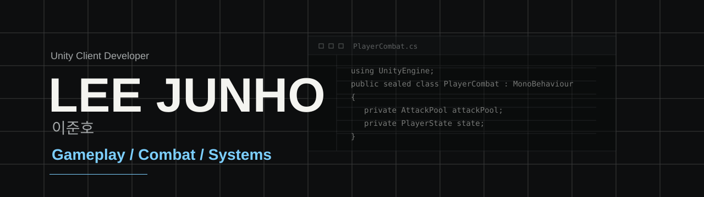

 

---

## Unity Client Developer

Unity와 C#을 다루는 게임 개발자를 꿈꾸는 대학생입니다. 단순히 기능을 구현하는 것을 넘어, 더 나은 구조와 유지보수를 위해 고민하고, 새로운 아키텍쳐나 스택을 배우는 것에 거부감없이 배우려는 자세를 가지고 있습니다.

## Selected Works

| Project | Role | Focus | Result |
| --- | --- | --- | --- |
| [Soul Collector](https://github.com/Byeo1ha/SoulCollector) | Main Game Programmer | Tower Defense, Turret Architecture, Object Pool | Capstone A+ / Best Team |
| [Cleanup Day](https://github.com/Byeo1ha/CleanupDay) | Main Game Programmer | Point-and-Click, Minigames, UI / Fade Polish | Daejeon Indie Game School Excellence Award |
| [Barrel good Barrel](https://github.com/Byeo1ha/Barrel-good-Barrel) | Sub Game Programmer | Random Room, Portal, Shop, Boss Cutscene | Daejeon Game Bridge Grand Prize |
| [Hungry Foxy 2](https://github.com/Byeo1ha/HungryFoxy2) | Solo Developer | Platformer Loop, Interaction, Cutscene | Academic Festival 1st Place |

## Stack

`Unity` `C#` `Git` `R3` `VContainer` `UniTask` `DOTween` `New Input System`  
`Interface` `Inheritance` `Object Pooling` `ScriptableObject` `Observer Pattern`

## Study Notes

- [UniTask](https://velog.io/@byeo1ha/%EB%81%84%EC%A0%81%EB%81%84%EC%A0%81-%EB%A9%94%EB%AA%A8%ED%95%98%EB%8A%94-UniTask)
- [VContainer](https://velog.io/@byeo1ha/%EB%81%84%EC%A0%81-%EB%81%84%EC%A0%81-%EB%A9%94%EB%AA%A8%ED%95%98%EB%8A%94-VContainer)
- [DOTween](https://velog.io/@byeo1ha/%EB%81%84%EC%A0%81-%EB%81%84%EC%A0%81-%EB%A9%94%EB%AA%A8%ED%95%98%EB%8A%94-DOTween)

---

자세한 프로젝트 설명과 GIF는 포트폴리오 사이트에서 확인할 수 있습니다.

### [byeo1ha.github.io](https://byeo1ha.github.io/)

