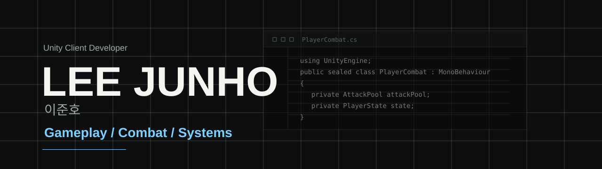

 

---
## Selected Works

| Project | Genre | Result |
| :---: | :---: | :---: |
| [Soul Collector](https://github.com/Byeo1ha/SoulCollector) | 타워 디펜스 | - |
| [Cleanup Day](https://github.com/Byeo1ha/CleanupDay) | 포인트 앤 클릭 | 2026 대전 인디 게임 스쿨 우수상 |
| [Barrel good Barrel](https://github.com/Byeo1ha/Barrel-good-Barrel) | 로그라이크 슈팅 | 2025 대전 게임 브릿지 인디 게임어스 대상 |
| [Hungry Foxy 2](https://github.com/Byeo1ha/HungryFoxy2) | 횡스크롤 플랫포머 | 2022 교내 학술제 1위 |

## Stack

`Unity` `C#` `Git` `R3` `VContainer` `UniTask` `DOTween` `New Input System`  
`Interface` `Inheritance` `Object Pooling` `ScriptableObject` `Observer Pattern`

## Stack Notes
- [R3](https://velog.io/@byeo1ha/끄적-끄적-메모하는-R3)
- [UniTask](https://velog.io/@byeo1ha/%EB%81%84%EC%A0%81%EB%81%84%EC%A0%81-%EB%A9%94%EB%AA%A8%ED%95%98%EB%8A%94-UniTask)
- [VContainer](https://velog.io/@byeo1ha/%EB%81%84%EC%A0%81-%EB%81%84%EC%A0%81-%EB%A9%94%EB%AA%A8%ED%95%98%EB%8A%94-VContainer)
- [DOTween](https://velog.io/@byeo1ha/%EB%81%84%EC%A0%81-%EB%81%84%EC%A0%81-%EB%A9%94%EB%AA%A8%ED%95%98%EB%8A%94-DOTween)

---

자세한 프로젝트 설명과 GIF는 포트폴리오 사이트에서 확인할 수 있습니다.

### [byeo1ha.github.io](https://byeo1ha.github.io/)

